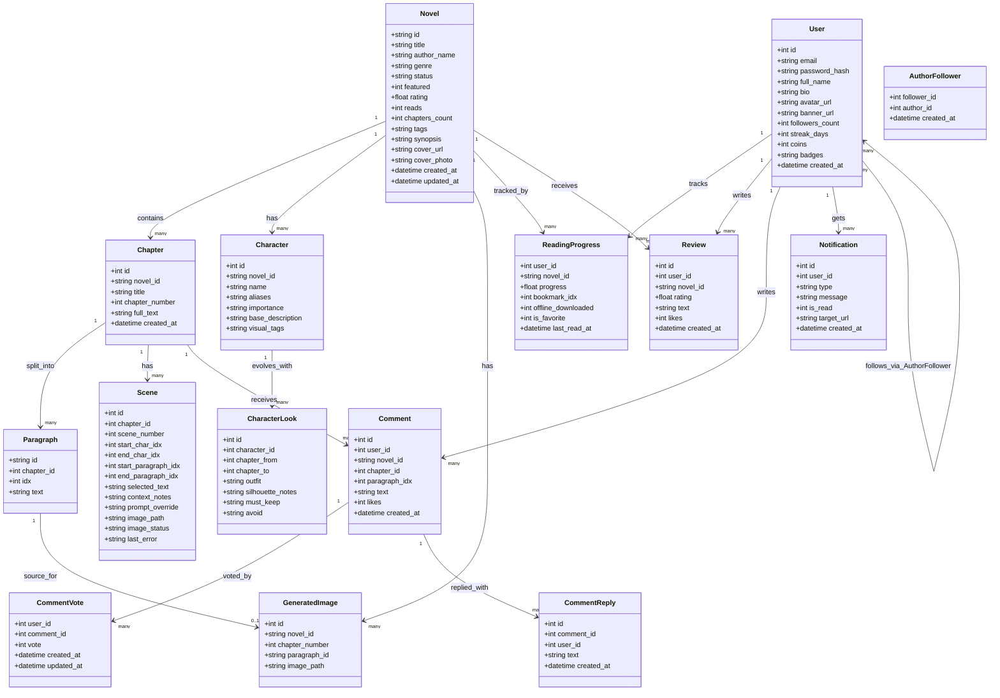
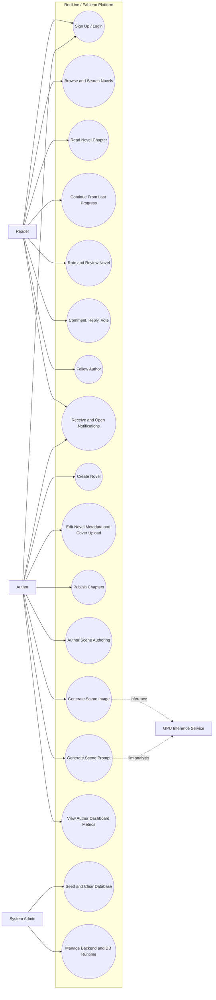

# RedLine / Fablean Tech Stack and UML

## 1) Frameworks, Tools, and Technologies Used

### Workspace-Level
- Node.js and npm for JavaScript package management and scripts
- Python 3.10+ and pip for GPU service
- Docker and Docker Compose for containerized infrastructure and deployment
- PowerShell scripts for local and remote setup automation
- Git and GitHub for source control and collaboration

### fablean_desktop (Web Frontend)
- React 19
- Vite 8
- React Router DOM
- Socket.IO Client
- Lucide React icon library
- ESLint (with React Hooks and React Refresh plugins)

### fablean_memory (Backend API and Data)
- Node.js
- Express 5
- PostgreSQL 16
- TypeORM DataSource (query execution + schema bootstrap)
- pg driver
- Socket.IO (real-time notifications)
- JWT (jsonwebtoken) for auth tokens
- bcryptjs for password hashing
- dotenv for environment variables
- multer for media uploads
- body-parser and cors middleware

### fablean_mobile (Mobile App)
- React Native
- Expo SDK 54
- expo-auth-session
- expo-constants
- expo-web-browser
- expo-status-bar

### fablean_lab (Desktop Prototype)
- Electron 34
- dotenv

### gpu_service (AI Inference Service)
- FastAPI
- Uvicorn
- PyTorch
- Diffusers
- Transformers
- Accelerate
- Hugging Face Hub
- Safetensors
- BitsAndBytes
- PEFT
- SciPy
- Pydantic
- python-multipart

### AI / Model Stack
- FLUX image generation pipeline
- SDXL pipeline fallback + scheduler options
- Qwen 2.5 7B Instruct for LLM scene direction/writing analysis
- LoRA support for style specialization

## 2) UML Class Diagram

## 3) UML Use Case Diagram

## 4) Notes
- The class diagram is derived from the backend PostgreSQL schema and active API behavior.
- The use case diagram covers reader flows, authoring flows, operations flows, and GPU-assisted AI flows.
